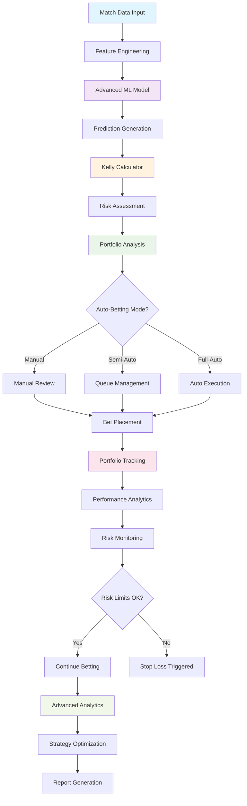
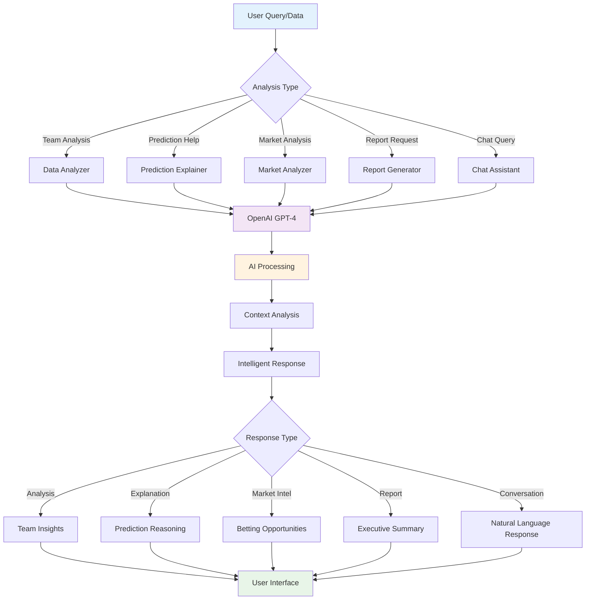

# FootyForecast - Soccer Bets Predictor

[](https://www.python.org/)
[](LICENSE)
[](#supported-platforms)

> 🚀 **AI-Powered Soccer Prediction System** - Analyze team performance and predict match outcomes using advanced Machine Learning algorithms!

## ⚡ Quick Start

### 🎯 **Get Started in 3 Steps:**

1. **📥 Clone & Install**
   ```bash
   git clone https://github.com/gregorizeidler/FootyForecast-Soccer-Bets-Predictor.git
   cd FootyForecast-Soccer-Bets-Predictor
   pip install -r requirements.txt
   ```

2. **🚀 Launch Application**
   ```bash
   python main.py
   ```

3. **⚽ Start Predicting**
   - Create/Load a league → Analyze data → Train models → Make predictions!

### 🎮 **What You Can Do:**
- 📊 **Analyze** 25+ soccer leagues worldwide
- 🤖 **Train** 8 different ML algorithms (Neural Networks, Random Forest, XGBoost, etc.)
- 🔮 **Predict** match outcomes (Home/Draw/Away + Over/Under 2.5 goals)
- 📈 **Visualize** team statistics and model performance
- 🎨 **Customize** with 4 beautiful themes

---

## 🎯 Use Cases & Examples

### 🏆 **Perfect For:**

#### 📊 **Data Scientists & ML Enthusiasts**
- **Experiment** with different algorithms on real soccer data
- **Compare** model performance using cross-validation
- **Analyze** feature importance and correlations
- **Tune** hyperparameters automatically with Optuna

#### ⚽ **Soccer Analysts**
- **Track** team performance trends over time
- **Identify** statistical patterns in match outcomes
- **Evaluate** home vs away team advantages
- **Study** goal-scoring patterns (Over/Under analysis)

#### 🎓 **Students & Researchers**
- **Learn** practical machine learning applications
- **Study** sports analytics methodologies
- **Research** predictive modeling techniques
- **Publish** academic papers (citation included!)

#### 💰 **Betting Enthusiasts** *(Bet Responsibly)*
- **Analyze** odds vs model predictions
- **Identify** value betting opportunities
- **Track** model accuracy over time
- **Make** data-driven decisions

### 🌟 **Real-World Examples:**

```
🔍 Example 1: Premier League Analysis
→ Load Premier League data
→ Train Random Forest model (85% accuracy)
→ Predict: Manchester City vs Arsenal
→ Result: Home Win (78% confidence)

📈 Example 2: Feature Analysis
→ Discover: "Home Goals Forward" most important feature
→ Teams scoring 2+ goals at home win 73% of matches
→ Use this insight for better predictions

🎯 Example 3: Multi-League Comparison
→ Compare Bundesliga vs Serie A patterns
→ Bundesliga: More goals per match (2.8 avg)
→ Serie A: More defensive games (2.3 avg)
```

---

## 🚀 System Workflow

```mermaid
flowchart TD
    A[🌐 Start FootyForecast] --> B{📊 League Available?}
    
    B -->|No| C[🏆 Create/Load League]
    B -->|Yes| D[📈 Data Analysis]
    
    C --> C1[🌍 Download League Data]
    C1 --> C2[⚽ Process Team Statistics]
    C2 --> C3[💾 Save League Configuration]
    C3 --> D
    
    D --> E[🔍 Choose Analysis Type]
    
    E --> F[📊 Correlation Analysis]
    E --> G[🎯 Target Distribution]
    E --> H[📈 Feature Importance]
    E --> I[📉 Variance Analysis]
    
    F --> J[🤖 Machine Learning Pipeline]
    G --> J
    H --> J
    I --> J
    
    J --> K[🧠 Select ML Algorithm]
    
    K --> L[🌳 Decision Tree]
    K --> M[🚀 XGBoost]
    K --> N[🔗 Neural Network]
    K --> O[🌲 Random Forest]
    K --> P[📐 SVM]
    K --> Q[📊 Logistic Regression]
    K --> R[🎲 Naive Bayes]
    K --> S[👥 Ensemble Model]
    
    L --> T[⚙️ Model Training]
    M --> T
    N --> T
    O --> T
    P --> T
    Q --> T
    R --> T
    S --> T
    
    T --> U[✅ Cross Validation]
    U --> V[📊 Model Evaluation]
    V --> W{🎯 Good Performance?}
    
    W -->|No| X[🔧 Hyperparameter Tuning]
    X --> T
    
    W -->|Yes| Y[🔮 Make Predictions]
    
    Y --> Z1[⚽ Single Match Prediction]
    Y --> Z2[📅 Fixture Predictions]
    
    Z1 --> AA[🏠 Home Win / ❌ Draw / 🛣️ Away Win]
    Z1 --> BB[⬆️ Over 2.5 / ⬇️ Under 2.5 Goals]
    
    Z2 --> CC[📋 Batch Predictions]
    CC --> DD[💰 Betting Recommendations]
    
    style A fill:#FF6B6B,stroke:#FF4757,stroke-width:3px,color:#fff
    style J fill:#4ECDC4,stroke:#26D0CE,stroke-width:3px,color:#fff
    style T fill:#45B7D1,stroke:#3742FA,stroke-width:3px,color:#fff
    style Y fill:#96CEB4,stroke:#00B894,stroke-width:3px,color:#fff
    style DD fill:#FECA57,stroke:#FF9F43,stroke-width:3px,color:#fff
    
    style L fill:#FF7675,stroke:#D63031,stroke-width:2px,color:#fff
    style M fill:#74B9FF,stroke:#0984E3,stroke-width:2px,color:#fff
    style N fill:#A29BFE,stroke:#6C5CE7,stroke-width:2px,color:#fff
    style O fill:#55A3FF,stroke:#2D3436,stroke-width:2px,color:#fff
    style P fill:#FD79A8,stroke:#E84393,stroke-width:2px,color:#fff
    style Q fill:#FDCB6E,stroke:#E17055,stroke-width:2px,color:#fff
    style R fill:#6C5CE7,stroke:#A29BFE,stroke-width:2px,color:#fff
    style S fill:#00B894,stroke:#00CEC9,stroke-width:2px,color:#fff
```



## 🏗️ System Architecture

```mermaid
graph TB
    subgraph "🖥️ User Interface Layer"
        GUI[🎨 Tkinter GUI]
        MENU[📋 Menu System]
        DIALOG[💬 Dialog Windows]
    end
    
    subgraph "🧠 Core Logic Layer"
        ANALYSIS[📊 Analysis Engine]
        ML[🤖 ML Pipeline]
        PREDICT[🔮 Prediction Engine]
    end
    
    subgraph "💾 Data Layer"
        DB[🗄️ League Repository]
        MODEL[🧪 Model Repository]
        CONFIG[⚙️ Configuration]
    end
    
    subgraph "🌐 External Data Sources"
        FOOTBALL[⚽ Football-Data.co.uk]
        FOOTY[📈 FootyStats.org]
    end
    
    subgraph "🔧 Processing Modules"
        PREPROCESS[🔄 Data Preprocessing]
        STATS[📊 Statistics Calculator]
        FEATURES[🎯 Feature Engineering]
    end
    
    subgraph "🤖 ML Algorithms"
        DT[🌳 Decision Tree]
        RF[🌲 Random Forest]
        NN[🔗 Neural Network]
        XGB[🚀 XGBoost]
        SVM[📐 SVM]
        NB[🎲 Naive Bayes]
        LR[📊 Logistic Regression]
        ENS[👥 Ensemble]
    end
    
    GUI --> ANALYSIS
    GUI --> ML
    GUI --> PREDICT
    
    ANALYSIS --> PREPROCESS
    ML --> PREPROCESS
    PREDICT --> MODEL
    
    PREPROCESS --> STATS
    STATS --> FEATURES
    
    ML --> DT
    ML --> RF
    ML --> NN
    ML --> XGB
    ML --> SVM
    ML --> NB
    ML --> LR
    ML --> ENS
    
    DB --> FOOTBALL
    DB --> FOOTY
    
    FEATURES --> DB
    MODEL --> CONFIG
    
    style GUI fill:#FF6B6B,stroke:#FF4757,stroke-width:3px,color:#fff
    style ML fill:#4ECDC4,stroke:#26D0CE,stroke-width:3px,color:#fff
    style PREDICT fill:#96CEB4,stroke:#00B894,stroke-width:3px,color:#fff
    style DB fill:#45B7D1,stroke:#3742FA,stroke-width:3px,color:#fff
    style FOOTBALL fill:#FECA57,stroke:#FF9F43,stroke-width:3px,color:#fff
    style FOOTY fill:#FECA57,stroke:#FF9F43,stroke-width:3px,color:#fff
```



## 📖 What is FootyForecast?

FootyForecast represents a comprehensive **open-source solution** for soccer match prediction powered by artificial intelligence. This innovative platform merges "Footy" (soccer terminology) with "Forecast" (predictive analytics) to deliver data-driven insights.

**🎯 Primary Capabilities:**
- **Performance Analytics:** Deep dive into team dynamics using cutting-edge ML algorithms and interactive visualizations
- **Statistical Computing:** Generate detailed metrics from historical match data across multiple leagues
- **Outcome Prediction:** Leverage ensemble learning approaches for accurate match result forecasting

**🤖 AI Engine Portfolio:**
- Advanced Neural Networks, Gradient Boosting (XGBoost), Random Forest Ensembles
- Support Vector Machines, K-Nearest Neighbors, Probabilistic Classifiers
- Decision Trees, Linear Models, and Hybrid Ensemble Architectures

**🔧 Intelligent Processing Pipeline:**
- **Data Preprocessing:** Automated normalization, feature scaling, and imbalanced dataset handling
- **Model Validation:** Robust cross-validation frameworks with holdout testing protocols
- **Optimization Engine:** Automated hyperparameter search using advanced optimization algorithms

**📊 Data Integration:**
- Comprehensive league coverage via [football-data.co.uk](https://www.football-data.co.uk/) API integration
- Real-time fixture parsing through [FootyStats.org](https://footystats.org/) connectivity
- **Network connectivity essential** for live data synchronization

## 🖥️ Desktop Application Interface

FootyForecast features an intuitive desktop environment built on modern GUI principles. The application architecture centers around a streamlined navigation system accessible through the primary menu bar, offering five distinct operational modules:

**📋 Navigation Structure:**
* **Application Hub:** League management operations (creation, loading, deletion)
* **Analytics Suite:** Statistical analysis tools and feature engineering workspace
* **ML Laboratory:** Model training environment, evaluation metrics, and prediction engine
* **Visual Customization:** Interface theming and appearance configuration
* **Learning Resources:** Comprehensive guides and machine learning documentation

**🎨 Visual Theme Collection:**
The platform includes four professionally designed interface themes optimized for different usage scenarios:

- **Breeze-Light:** Minimalist design for daytime productivity sessions
- **Breeze-Dark:** Low-light optimized interface for extended analysis periods  
- **Forest-Light:** Nature-inspired aesthetics for comfortable long-term usage
- **Forest-Dark:** Professional dark mode with enhanced visual contrast

## 📊 Advanced Team Analytics Engine

FootyForecast employs sophisticated statistical modeling to extract meaningful insights from team performance data. The analytics engine processes comprehensive datasets to generate **16 distinct performance indicators** for each participating team, creating detailed behavioral profiles for both home and visiting sides.

**🏠 Home Team Performance Metrics:**

1. **Domestic Victory Count (HW)**: Recent winning streak analysis for home venue performance
2. **Home Defeat Frequency (HL)**: Loss pattern identification within home territory
3. **Offensive Home Output (HGF)**: Cumulative scoring performance in recent home fixtures
4. **Defensive Home Vulnerability (HGA)**: Goals conceded analysis during home matches
5. **Dominant Home Victories (HGD-W)**: High-margin wins with significant goal differential (≥2 goals)
6. **Heavy Home Defeats (HGD-L)**: Substantial losses indicating defensive weaknesses
7. **Home Success Percentage (HW%)**: Season-long home venue win ratio
8. **Home Failure Rate (HL%)**: Cumulative home defeat percentage

**🛣️ Away Team Performance Indicators:**
9. **Road Victory Analysis (AW)**: Away fixture success patterns and trends
10. **Travel Defeat Metrics (AL)**: Loss frequency during away campaigns
11. **Away Scoring Efficiency (AGF)**: Goal production capability in foreign venues
12. **Road Defensive Stability (AGA)**: Defensive resilience away from home
13. **Commanding Away Wins (AGD-W)**: Decisive victories with substantial goal margins
14. **Significant Away Losses (AGD-L)**: Major defeats highlighting away vulnerabilities
15. **Away Success Ratio (AW%)**: Overall away performance success rate
16. **Road Defeat Percentage (AL%)**: Away fixture failure frequency

**⚙️ Customizable Analytics:** All performance indicators can be dynamically configured during league setup, allowing users to tailor the analytical framework to specific research requirements.

## 🌍 Global League Coverage

FootyForecast maintains comprehensive coverage of **13 premier soccer competitions** across multiple continents, sourcing official match data through the football-data.co.uk platform. The supported league ecosystem includes:
* 'Argentina': [PrimeraDivision]
* 'Belgium': [JupilerLeague]
* 'Brazil': [BrazilSerieA]
* 'China': [ChinaSuperLeague]
* 'Denmark': [SuperLiga]
* 'England': [PremierLeague, Championshio, League1, League2]
* 'Finland': [VeikkausLiiga]
* 'France': [Ligue1, Ligue2]
* 'Germany': [Bundesliga1, Bundesliga2]
* 'Greece': [SuperLeague]
* 'Ireland': [IrelandPremierDivision]
* 'Italy': [SerieA, SerieB]
* 'Japan': [J1]
* 'Mexico': [LigaMX]
* 'Netherlands': [Eredivisie]
* 'Norgway': [Eliteserien]
* 'Poland': [Ekstraklasa]
* 'Portugal': [Liga1]
* 'Romania': [RomaniaLiga1]
* 'Russia': [RussiaPremierLeague]
* 'Scotland': [Premiership]
* 'Spain': [LaLiga, SegundaDivision]
* 'Sweden': [Allsvenskan]
* 'Switzerland': [SwitzerlandSuperLeague]
* 'USA': [MLS]
* 'Turkey': [SuperLig]


You can add additional leagues by modifying the `database/leagues.csv` configuration file. In order to add a new league, you need to specify:
1. Country (The country of the league, e.g. Russia)
2. League Name (The name of the league e.g. Premier League)
3. League ID: You can create multiple leagues, but with different ID.
4. The statistical odds that will be used to train the models.

## 🔗 Statistical Correlation Framework

The correlation analysis module serves as a critical component for evaluating dataset integrity and feature relationships. FootyForecast generates interactive correlation matrices that visualize the interdependencies between statistical variables through advanced heatmap representations.

**📈 Correlation Coefficient Analysis:**
The system employs Pearson correlation coefficients (r ∈ [-1.0, 1.0]) to quantify linear relationships between feature pairs. Optimal feature selection occurs when variables demonstrate minimal correlation (approaching r = 0), indicating independent predictive value. Strong correlations (|r| > 0.7) may suggest redundant features requiring dimensionality reduction.


## 🎯 Feature Significance Assessment

The platform integrates sophisticated **model interpretability frameworks** designed to illuminate the relative importance of statistical variables in predictive accuracy. This analytical capability addresses the critical question: "Which performance metrics drive the most reliable predictions?"

**🔍 Multi-Method Importance Evaluation:**
- **Variance Analysis:** Statistical variance decomposition to identify high-impact variables
- **Recursive Feature Elimination:** Systematic backward selection using cross-validated performance metrics  
- **Tree-Based Importance Scoring:** Random Forest-derived feature ranking through impurity reduction analysis


## ⚖️ Class Distribution & Imbalance Management

Dataset analysis reveals that numerous soccer leagues exhibit **inherent class imbalances**, where home team victories significantly outnumber away team successes. This statistical skew can introduce systematic bias into machine learning models, leading to overconfident predictions favoring home teams.

**📊 Imbalance Detection & Visualization:**
FootyForecast employs **Target Distribution Analysis** to identify and quantify class imbalances across different leagues, providing visual representations of outcome frequency distributions.

**🔧 Bias Mitigation Strategies:**
- **Stochastic Noise Injection:** Controlled randomization to improve model generalization
- **Probability Calibration:** Post-processing techniques to adjust prediction confidence levels
- **Advanced Resampling Methods:** SMOTE variants, Near-Miss algorithms, and hybrid sampling approaches


## 🧠 Deep Learning Architecture Training

FootyForecast implements state-of-the-art **artificial neural network architectures** specifically optimized for soccer match prediction tasks. The deep learning framework supports multi-layer perceptron configurations with customizable activation functions, regularization techniques, and optimization algorithms.

**🔗 Technical Reference:** [Neural Network Fundamentals](https://www.investopedia.com/terms/n/neuralnetwork.asp)

## 🤖 Machine Learning Algorithm Portfolio

The platform provides access to **eight distinct algorithmic approaches**, each offering unique advantages for different prediction scenarios:

1. **K-Nearest Neighbors (KNN)** - Instance-based learning with distance metrics
2. **Logistic Regression** - Linear probabilistic classification framework
3. **Naive Bayes** - Probabilistic classifier based on Bayes' theorem
4. **Decision Tree** - Rule-based hierarchical decision structures
5. **Random Forest** - Ensemble of decision trees with bootstrap aggregation
6. **XGBoost** - Gradient boosting with advanced regularization
7. **Support Vector Machine (SVM)** - Maximum margin hyperplane optimization
8. **Deep Neural Networks** - Multi-layer artificial neural architectures

## 🌲 Ensemble Forest Training Methodology

The Random Forest implementation leverages **bootstrap aggregating (bagging)** combined with random feature selection to create robust ensemble predictions. This approach reduces overfitting while maintaining high predictive accuracy across diverse league characteristics.

**🔗 Algorithmic Details:** [Random Forest Implementation Guide](https://www.section.io/engineering-education/introduction-to-random-forest-in-machine-learning/)


## 🎭 Hybrid Ensemble Architecture

The ensemble methodology represents an advanced **meta-learning approach** that synthesizes predictions from multiple algorithmic sources. While individual models like Random Forest and Neural Networks may demonstrate comparable performance under optimal tuning, prediction divergence scenarios often arise where different algorithms assign varying confidence levels to the same outcome.

**🔄 Voting Mechanism:**
The ensemble framework employs **weighted probability averaging** across constituent models, leveraging the collective intelligence of diverse algorithmic perspectives. This approach capitalizes on the principle that individual model biases can be mitigated through strategic combination, resulting in superior predictive robustness.

## 📊 Model Performance Evaluation

Comprehensive model assessment constitutes a critical phase before deployment in live prediction scenarios. The evaluation framework provides detailed insights into model reliability, prediction confidence distributions, and performance characteristics across different match contexts.

**🎯 Multi-Dimensional Assessment:**
- **Cross-Model Comparison:** Systematic analysis of prediction agreement between different algorithms
- **Confidence Interval Analysis:** Statistical evaluation of prediction certainty levels
- **Stratified Performance Reports:** Accuracy metrics segmented by betting odds ranges and team strength categories


## 🔮 Match Outcome Prediction Engine

The prediction interface requires specification of **competing teams and current betting odds** to generate comprehensive match forecasts. Optimal prediction reliability occurs when multiple models demonstrate consensus; divergent predictions across algorithms typically indicate higher uncertainty scenarios requiring cautious interpretation.

**📈 Prediction Categories:**
1. **Match Result Classification:** Home Victory / Draw / Away Victory
2. **Goal Total Forecasting:** Over 2.5 Goals / Under 2.5 Goals

## 📅 Automated Fixture Processing

The **Fixture Parsing Module** enables batch prediction capabilities through automated web scraping of upcoming match schedules. This feature streamlines the prediction workflow by eliminating manual fixture entry requirements.

**🔄 Processing Workflow:**
Users select their preferred web browser and target date, triggering automated page retrieval and fixture extraction for the specified timeframe. The system processes all identified matches and generates comprehensive prediction reports for the entire fixture list.

---

## 🤖 AI-Powered Insights & Analysis

FootyForecast integrates **OpenAI's GPT-4** to provide intelligent analysis, explanations, and insights that go beyond traditional statistical analysis. The AI system transforms raw data into actionable intelligence through natural language processing.

### 🧠 **1. Intelligent Data Analysis**

**Smart Team Performance Analysis:**
```python
from ai_insights import DataAnalyzer, OpenAIClient

# Initialize AI client
ai_client = OpenAIClient(api_key="your-openai-key")
analyzer = DataAnalyzer(ai_client)

# Analyze team performance
team_data = {
    'home_stats': {'wins': 8, 'losses': 1, 'goals_for': 24},
    'away_stats': {'wins': 6, 'losses': 2, 'goals_for': 18},
    'recent_form': ['W', 'W', 'W', 'D', 'W']
}

insights = analyzer.analyze_team_performance(team_data)
```

**🎯 Key Features:**
- **Performance Trend Analysis:** AI identifies patterns in team performance over time
- **Strength & Weakness Detection:** Automated identification of tactical advantages
- **Anomaly Detection:** Highlights unusual performances requiring attention
- **Comparative Analysis:** Intelligent team-vs-team comparisons with tactical insights

### 🔍 **2. AI Prediction Explainer**

Transform complex model decisions into clear, understandable explanations:

```python
from ai_insights import PredictionExplainer

explainer = PredictionExplainer(ai_client)

# Explain why model predicted specific outcome
prediction_result = {
    'predicted_outcome': 'Home Win',
    'confidence': 0.78,
    'probabilities': {'Home': 0.78, 'Draw': 0.15, 'Away': 0.07}
}

explanations = explainer.explain_prediction(
    prediction_result, 
    model_features, 
    team_names=('Manchester City', 'Arsenal')
)
```

**📊 Explanation Types:**
- **Basic Explanations:** Simple, accessible reasoning for any user level
- **Feature Analysis:** Deep dive into which statistics drove the prediction
- **Confidence Assessment:** Why the model is more/less certain about outcomes
- **Risk Factor Identification:** Potential scenarios that could change the prediction

### 🎓 **3. Educational AI Tutor**

**Interactive Learning System:**
```python
from ai_insights import ChatAssistant

assistant = ChatAssistant(ai_client)

# Ask questions about concepts
response = assistant.explain_concept(
    concept="Random Forest in soccer prediction",
    user_level="beginner"
)

# Get help with current analysis
help_response = assistant.get_prediction_help(
    prediction_data=current_prediction,
    user_question="Why is the confidence so low?"
)
```

**🎯 Learning Features:**
- **Concept Explanations:** Clear definitions of ML and soccer analytics terms
- **Interactive Q&A:** Natural language queries about your data and predictions
- **Personalized Guidance:** Recommendations based on your experience level
- **Troubleshooting Support:** AI-powered help for technical issues

### 💰 **4. Smart Market Analysis**

**AI-Powered Betting Intelligence:**
```python
from ai_insights import MarketAnalyzer

market_analyzer = MarketAnalyzer(ai_client)

# Analyze value betting opportunities
model_probabilities = {'Home': 0.65, 'Draw': 0.25, 'Away': 0.10}
bookmaker_odds = {'Home': 1.8, 'Draw': 3.5, 'Away': 8.0}

value_analysis = market_analyzer.analyze_value_betting_opportunity(
    model_probabilities, 
    bookmaker_odds, 
    ('Arsenal', 'Chelsea')
)
```

**📈 Market Intelligence:**
- **Value Bet Detection:** Identify mathematically profitable betting opportunities
- **Market Efficiency Analysis:** Compare model accuracy vs bookmaker predictions
- **Bankroll Management:** AI-powered betting size recommendations using Kelly Criterion
- **Odds Movement Analysis:** Understand what market changes mean for your predictions

### 📊 **5. Executive AI Reports**

**Automated Intelligence Reports:**
```python
from ai_insights import ReportGenerator

report_gen = ReportGenerator(ai_client)

# Generate comprehensive weekly report
weekly_report = report_gen.generate_weekly_performance_report(
    weekly_data=performance_metrics,
    model_performance=accuracy_stats,
    predictions_made=prediction_history
)
```

**📋 Report Types:**
- **Performance Summaries:** Weekly/monthly model accuracy and insights
- **League Analysis:** Deep dives into specific league patterns and trends
- **Model Comparisons:** AI-powered analysis of which models work best when
- **Market Reports:** Betting market efficiency and opportunity analysis

### 💬 **6. Conversational AI Assistant**

**Natural Language Interface:**
```python
# Chat naturally with your data
assistant.chat("Which team has the best defense in Premier League?")
assistant.chat("Show me teams that improved after coaching changes")
assistant.chat("What factors make predictions less reliable?")

# Get contextual help
assistant.ask_about_data(
    "Why did the model get this prediction wrong?",
    data_context=current_match_data
)
```

**🗣️ Conversation Features:**
- **Natural Queries:** Ask questions in plain English about your data
- **Context Awareness:** AI remembers your conversation and current analysis
- **Smart Suggestions:** Proactive recommendations for improving your analysis
- **Multi-turn Conversations:** Build on previous questions for deeper insights

### 🚀 **Getting Started with AI Features**

**1. Setup OpenAI Integration:**
```bash
# Install additional AI requirements
pip install -r requirements_ai.txt

# Set your OpenAI API key
export OPENAI_API_KEY="your-api-key-here"
```

**2. Basic AI Usage:**
```python
from ai_insights import OpenAIClient, ChatAssistant

# Initialize AI system
ai_client = OpenAIClient()
assistant = ChatAssistant(ai_client)

# Start chatting with your data
response = assistant.chat("Explain my latest prediction")
print(response)
```

**3. Advanced Analysis:**
```python
from ai_insights import DataAnalyzer, PredictionExplainer, MarketAnalyzer

# Full AI analysis pipeline
analyzer = DataAnalyzer(ai_client)
explainer = PredictionExplainer(ai_client)
market = MarketAnalyzer(ai_client)

# Comprehensive AI-powered analysis
team_insights = analyzer.analyze_team_performance(team_data)
prediction_explanation = explainer.explain_prediction(prediction_result)
market_opportunities = market.analyze_value_betting_opportunity(model_probs, odds)
```

### 🎯 **AI Use Cases**

**For Data Scientists:**
- "Explain why Random Forest outperformed Neural Networks on this dataset"
- "What features should I engineer to improve Premier League predictions?"
- "Analyze the correlation between weather and goal-scoring patterns"

**For Soccer Analysts:**
- "Compare Manchester City's attacking patterns vs last season"
- "Which teams perform better under pressure in crucial matches?"
- "Identify tactical changes that improved team performance"

**For Betting Enthusiasts:**
- "Find value bets where bookmakers underestimate away teams"
- "Analyze my betting history and suggest improvements"
- "Calculate optimal bet sizes using Kelly Criterion"

**For Beginners:**
- "What does 'expected goals' mean and why is it important?"
- "How do I interpret correlation matrices?"
- "Which machine learning model should I use for my first prediction?"

### ⚙️ **AI Configuration**

**Environment Setup:**
```bash
# Required environment variables
export OPENAI_API_KEY="sk-your-key-here"
export OPENAI_MODEL="gpt-4"  # Optional, defaults to gpt-4
```

**Customization Options:**
- **Model Selection:** Choose between GPT-4, GPT-3.5-turbo for different use cases
- **Temperature Control:** Adjust creativity vs accuracy in AI responses
- **Context Management:** Configure how much conversation history to maintain
- **Response Length:** Control detailed vs concise AI explanations

### 🔒 **Privacy & Security**

- **Data Privacy:** Your match data is only sent to OpenAI for analysis, not stored
- **API Security:** All communications use secure HTTPS encryption
- **Local Processing:** Core predictions still work without AI features
- **Optional Integration:** AI features are completely optional and can be disabled

---

# 💰 Betting Intelligence System

FootyForecast features a comprehensive **Betting Intelligence System** with advanced portfolio management, risk analysis, and automated betting capabilities. This professional-grade system combines mathematical precision with AI-powered insights.

## 🎯 **Core Betting Intelligence Modules**

### 📊 **1. Portfolio Tracker**
**Professional betting portfolio management with comprehensive analytics**

```python
from betting_intelligence import PortfolioTracker

# Initialize portfolio tracker
portfolio = PortfolioTracker("my_portfolio.json")

# Add a bet
bet_id = portfolio.add_bet(
    match_info={'home_team': 'Manchester City', 'away_team': 'Arsenal', 'league': 'Premier League'},
    bet_type='Home',
    odds=1.85,
    stake=50.0,
    prediction_confidence=0.75,
    bookmaker='Bet365'
)

# Settle bet
portfolio.settle_bet(bet_id, 'won')

# Get comprehensive analytics
summary = portfolio.get_portfolio_summary()
performance = portfolio.get_performance_by_category()
monthly = portfolio.get_monthly_performance()
```

**📈 Key Features:**
- **ROI Tracking:** Real-time return on investment calculation
- **Win Rate Analysis:** Detailed win/loss statistics
- **Category Performance:** Analysis by bet type, league, bookmaker
- **Monthly Reports:** Time-based performance tracking
- **Export Capabilities:** CSV export for external analysis
- **Streak Analysis:** Winning/losing streak identification

### 🎲 **2. Kelly Criterion Calculator**
**Mathematically optimal bet sizing for maximum long-term growth**

```python
from betting_intelligence import KellyCalculator

kelly = KellyCalculator()

# Calculate optimal stake
result = kelly.calculate_stake_amount(
    bankroll=1000.0,
    probability=0.65,
    odds=2.1,
    fractional_kelly=0.25  # Conservative quarter-Kelly
)

print(f"Recommended stake: ${result['recommended_stake_amount']:.2f}")
print(f"Expected value: {result['expected_value']:.3f}")
print(f"Should bet: {result['should_bet']}")

# Analyze multiple opportunities
opportunities = [
    {'probability': 0.6, 'odds': 2.0},
    {'probability': 0.7, 'odds': 1.8},
    {'probability': 0.55, 'odds': 2.2}
]

multi_analysis = kelly.analyze_multiple_bets(opportunities, 1000.0)
```

**🎯 Advanced Features:**
- **Fractional Kelly:** Conservative sizing options (1/4, 1/2, full Kelly)
- **Multi-Bet Analysis:** Optimal allocation across opportunities
- **Simulation Tools:** Monte Carlo performance simulation
- **Comparison Tools:** Compare different Kelly fractions
- **Risk Assessment:** Built-in risk warnings and recommendations

### 🛡️ **3. Risk Management System**
**Advanced risk controls and portfolio protection**

```python
from betting_intelligence import RiskManager

risk_manager = RiskManager(
    max_daily_risk=0.02,      # 2% max daily risk
    max_single_bet_risk=0.01, # 1% max per bet
    max_drawdown_limit=0.10   # 10% max drawdown
)

# Assess single bet risk
risk_assessment = risk_manager.assess_bet_risk(
    stake=50.0,
    bankroll=1000.0,
    probability=0.65,
    odds=2.1
)

# Portfolio risk analysis
portfolio_risk = risk_manager.analyze_portfolio_risk(
    current_bets=active_bets,
    bankroll=1000.0
)

# Drawdown monitoring
drawdown_analysis = risk_manager.monitor_drawdown(
    current_bankroll=950.0,
    peak_bankroll=1000.0,
    recent_performance=recent_bets
)
```

**🔒 Risk Controls:**
- **Position Sizing:** Automatic stake size limits
- **Daily Risk Limits:** Maximum daily exposure controls
- **Drawdown Protection:** Automatic stop-loss triggers
- **Portfolio Diversification:** Risk distribution analysis
- **Correlation Analysis:** Identify concentrated risks
- **Real-time Monitoring:** Continuous risk assessment

### 💎 **4. Arbitrage Detector**
**Guaranteed profit opportunity identification**

```python
from betting_intelligence import ArbitrageDetector

arbitrage = ArbitrageDetector(min_profit_threshold=0.01)

# Detect arbitrage across bookmakers
bookmaker_odds = {
    'Bet365': {'Home': 2.1, 'Draw': 3.2, 'Away': 3.8},
    'William Hill': {'Home': 2.0, 'Draw': 3.3, 'Away': 4.0},
    'Pinnacle': {'Home': 2.15, 'Draw': 3.1, 'Away': 3.9}
}

arbitrage_result = arbitrage.detect_arbitrage_opportunity(bookmaker_odds)

if arbitrage_result['arbitrage_exists']:
    print(f"Guaranteed profit: {arbitrage_result['profit_percentage']:.2f}%")
    print(f"Stake distribution: {arbitrage_result['stake_distribution']}")
```

**💰 Arbitrage Features:**
- **Multi-Bookmaker Scanning:** Detect opportunities across platforms
- **Optimal Stake Calculation:** Perfect profit distribution
- **Margin Analysis:** Bookmaker competitiveness assessment
- **Cross-Market Arbitrage:** Different market type opportunities
- **Odds Movement Monitoring:** Track changing opportunities
- **Bankroll Allocation:** Optimal capital distribution

### 📈 **5. Advanced Analytics**
**Deep performance analysis and pattern recognition**

```python
from betting_intelligence import AdvancedAnalytics

analytics = AdvancedAnalytics()

# Comprehensive streak analysis
streak_analysis = analytics.analyze_streaks(betting_history)
print(f"Current streak: {streak_analysis['current_streak']['type']} ({streak_analysis['current_streak']['length']})")

# Seasonal performance patterns
seasonal_analysis = analytics.analyze_seasonal_performance(betting_history)
print(f"Best month: {seasonal_analysis['best_periods']['month']}")
print(f"Best day: {seasonal_analysis['best_periods']['weekday']}")

# League profitability analysis
league_analysis = analytics.analyze_league_profitability(betting_history)

# Bet type optimization
bet_type_analysis = analytics.analyze_bet_type_optimization(betting_history)
```

**🔍 Analytics Capabilities:**
- **Streak Analysis:** Win/loss pattern identification
- **Seasonal Trends:** Performance by month, day, hour
- **League Profitability:** ROI analysis by competition
- **Bet Type Optimization:** Most profitable bet categories
- **Performance Attribution:** Factor contribution analysis
- **Predictive Insights:** Future performance indicators

### 🤖 **6. Auto-Betting System**
**Intelligent automated betting with queue management**

```python
from betting_intelligence import AutoBettingSystem, AutoBettingMode

auto_betting = AutoBettingSystem(kelly, risk_manager, portfolio)

# Configure system
auto_betting.configure_system(
    mode=AutoBettingMode.SEMI_AUTO,
    bankroll=1000.0,
    daily_profit_target=100.0,
    daily_loss_limit=50.0,
    max_concurrent_bets=3
)

# Add bet to queue
queue_result = auto_betting.add_bet_to_queue(
    match_info={'home_team': 'PSG', 'away_team': 'Marseille'},
    bet_type='Home',
    odds=1.7,
    probability=0.72
)

# Start auto-execution
auto_betting.start_auto_execution()
```

**⚡ Automation Features:**
- **Smart Queue Management:** Prioritized bet execution
- **Risk-Based Filtering:** Automatic opportunity screening
- **Stop-Loss Automation:** Protective position closure
- **Profit Target System:** Automatic profit taking
- **Schedule Management:** Time-based bet execution
- **Performance Monitoring:** Real-time system analytics

### 🧠 **7. Advanced ML Model (50+ Features)**
**State-of-the-art machine learning with comprehensive feature engineering**

```python
from betting_intelligence import AdvancedFootballModel

model = AdvancedFootballModel()

# Train with comprehensive features
training_results = model.train_models(historical_match_data)
print(f"Best model: {training_results['best_model']}")
print(f"Features used: {training_results['features_count']}")

# Feature importance analysis
feature_analysis = model.get_feature_analysis()
print("Top 5 features:")
for feature, importance in feature_analysis['top_features'][:5]:
    print(f"  {feature}: {importance['avg_importance']:.3f}")

# Make predictions
prediction = model.predict_match(match_data)
print(f"Prediction: {prediction['prediction']}")
print(f"Confidence: {prediction['confidence']:.3f}")
```

**🎯 Model Features (50+ Total):**

**Team Performance (20 features):**
- Recent form analysis (last 5 matches)
- Season statistics (wins, draws, losses)
- Home/away specific performance
- Form difference calculations

**Goal Statistics (15 features):**
- Goals scored/conceded averages
- Expected goals (xG) metrics
- Attack/defense strength ratings
- Goal difference analysis

**Market & Odds (10 features):**
- Bookmaker odds analysis
- Implied probability calculations
- Market efficiency indicators
- Value betting identification

**Head-to-Head (8 features):**
- Historical matchup analysis
- H2H win rates and patterns
- Average goals in meetings
- Over/under tendencies

**Contextual Factors (12 features):**
- League characteristics
- Match importance scaling
- Rest days and fatigue
- Derby and cup match flags

**Advanced Metrics (10+ features):**
- Possession statistics
- Shot accuracy rates
- Defensive solidity
- Card discipline metrics

### 🎯 **8. Comprehensive Betting Analyzer**
**Unified analysis combining all modules**

```python
from betting_intelligence import BettingAnalyzer

analyzer = BettingAnalyzer()

# Complete opportunity analysis
analysis = analyzer.analyze_betting_opportunity(
    opportunity=betting_opportunity,
    bankroll=1000.0,
    bookmaker_odds=multiple_bookmaker_odds
)

# Strategy optimization
strategy = analyzer.optimize_betting_strategy(
    opportunities=available_opportunities,
    bankroll=1000.0,
    strategy_type='balanced'  # conservative, balanced, aggressive
)

# Generate comprehensive report
report = analyzer.generate_betting_report(
    bankroll=1000.0,
    opportunities=current_opportunities
)
```

## 🔄 **Betting Intelligence Workflow**



## 🚀 **Getting Started with Betting Intelligence**

### **1. Installation**
```bash
# Install betting intelligence requirements
pip install -r requirements_betting.txt

# Basic setup
from betting_intelligence import *

# Initialize core components
portfolio = PortfolioTracker()
kelly = KellyCalculator()
risk_manager = RiskManager()
analyzer = BettingAnalyzer()
```

### **2. Basic Workflow**
```python
# 1. Analyze opportunity
opportunity = {
    'match_info': {'home_team': 'Team A', 'away_team': 'Team B'},
    'probability': 0.65,
    'odds': 2.1,
    'bet_type': 'Home'
}

analysis = analyzer.analyze_betting_opportunity(opportunity, bankroll=1000.0)

# 2. Check recommendation
if analysis['recommendation']['overall'] == 'RECOMMENDED':
    # 3. Add to portfolio
    bet_id = portfolio.add_bet(**opportunity)
    
    # 4. Monitor and settle
    # ... (after match)
    portfolio.settle_bet(bet_id, 'won')

# 5. Analyze performance
summary = portfolio.get_portfolio_summary()
```

### **3. Advanced Usage**
```python
# Complete betting intelligence pipeline
from betting_intelligence import *

# Initialize system
system = {
    'portfolio': PortfolioTracker(),
    'kelly': KellyCalculator(),
    'risk': RiskManager(),
    'arbitrage': ArbitrageDetector(),
    'analytics': AdvancedAnalytics(),
    'auto_betting': AutoBettingSystem(),
    'ml_model': AdvancedFootballModel(),
    'analyzer': BettingAnalyzer()
}

# Train ML model
system['ml_model'].train_models(historical_data)

# Configure auto-betting
system['auto_betting'].configure_system(
    mode=AutoBettingMode.SEMI_AUTO,
    daily_profit_target=100.0
)

# Analyze opportunities
for opportunity in daily_opportunities:
    analysis = system['analyzer'].analyze_betting_opportunity(
        opportunity, bankroll, bookmaker_odds
    )
    
    if analysis['recommendation']['overall'] == 'RECOMMENDED':
        system['auto_betting'].add_bet_to_queue(**opportunity)

# Generate reports
report = system['analyzer'].generate_betting_report(bankroll)
```

## 📊 **Performance Metrics**

The Betting Intelligence system tracks comprehensive metrics:

- **📈 ROI Analysis:** Real-time return calculations
- **🎯 Accuracy Tracking:** Prediction vs actual results
- **💰 Profit/Loss:** Detailed P&L statements
- **📉 Drawdown Monitoring:** Risk exposure tracking
- **⚡ Execution Efficiency:** Auto-betting performance
- **🔍 Value Detection:** Market inefficiency identification

---

# 🤖 AI-Powered Insights & Analysis Workflow



---

# 📸 Visual Interface & Features Documentation

## Stunning Graphical Interface

The user interface is pretty simple: Every action can be done via a menu-bar on the top of the application. There are 5 available menus:

* Application: Create/Load/Delete Leagues
* Analysis: Data Analysis & Feature Importance
* Model: Train/Evaluate Models & Predict Matches
* Theme: Select a Theme for the Application Window
* Help: Additional Resources to Read about Machine Learning Topics

Also, 4 custom themes have been added and can be selected via "Theme" menu. The themes are:

1. Breeze-Light
1. Breeze-Dark
1. Forest-Light
1. Forest-Dark


## League Statistics

For each league, the application computes several statistics (features) about the teams, including their form, the performance of the last N matches, etc. The stats are computed for both the home team and the away team. More specifically:

1. **Home Wins (HW)**: Last N wins of the home team in its home
2. **Home Losses (HL)**: Last N losses of the home team in its home
3. **Home Goal Forward (HGF)**: Sum of goals that the home team scored in the last N matches in its home
4. **Home Goal Against (HGA)**: Sum of goals that the away teams scored in the last N matches.
5. **Home G-Goal Difference Wins (HGD-W)** Last N wins of the home team with G difference in the final score in its home (${HG - AG ≥ 2}$)
6. **Home G-Goal Difference Losses (HGD-L)** Last N losses of the home team with G difference in the final score in its home (${HG - AG ≥ 2}$)
7. **Home Win Rate (HW%)** Total win rate of the home team from the start of the league in its home
8. **Home Loss Rate (HL%)** Total loss rate of the home team from the start of the league in its home
9. **Away Wins (AW)**: Last N wins of the away team away its home
10. **Away Losses (AL)**: Last N losses of the away team away its home
11. **Away Goal Forward (AGF)**: Sum of goals that the away team scored in the last N matches away its home
12. **Away Goal Against (AGA)**: Sum of goals that the home teams scored in the last N matches.
13. **Away G-Goal Difference Wins (AGD-W)** Last N wins of the away team with G difference in the final score away its home(${HG - AG ≥ 2}$)
14. **Away G-Goal Difference Losses (AGD-L)** Last N losses of the away team with G difference in the final score away its home (${HG - AG ≥ 2}$)
15. **Away Win Rate (AW%)** Total win rate from the start of the league away its home
16. **Away Loss Rate (AL%)** Total loss rate from the start of the league away its home

Each column can be added or removed from a league during the creating phase.

## Leagues

FootyForecast provides 11 main soccer leagues and 2 extras, which are downloaded by https://www.football-data.co.uk/. More specifically, these leagues are:

* 'Argentina': [PrimeraDivision]
* 'Belgium': [JupilerLeague]
* 'Brazil': [BrazilSerieA]
* 'China': [ChinaSuperLeague]
* 'Denmark': [SuperLiga]
* 'England': [PremierLeague, Championship, League1, League2]
* 'Finland': [VeikkausLiiga]
* 'France': [Ligue1, Ligue2]
* 'Germany': [Bundesliga1, Bundesliga2]
* 'Greece': [SuperLeague]
* 'Ireland': [IrelandPremierDivision]
* 'Italy': [SerieA, SerieB]
* 'Japan': [J1]
* 'Mexico': [LigaMX]
* 'Netherlands': [Eredivisie]
* 'Norway': [Eliteserien]
* 'Poland': [Ekstraklasa]
* 'Portugal': [Liga1]
* 'Romania': [RomaniaLiga1]
* 'Russia': [RussiaPremierLeague]
* 'Scotland': [Premiership]
* 'Spain': [LaLiga, SegundaDivision]
* 'Sweden': [Allsvenskan]
* 'Switzerland': [SwitzerlandSuperLeague]
* 'USA': [MLS]
* 'Turkey': [SuperLig]

You can add additional leagues by modifying the `database/leagues.csv` configuration file. In order to add a new league, you need to specify:

1. Country (The country of the league, e.g. Russia)
2. League Name (The name of the league e.g. Premier League)
3. League ID: You can create multiple leagues, but with different ID.
4. The statistical odds that will be used to train the models.

## Feature Correlation Analysis

This is particularly useful when analyzing the quality of the training data. FootyForecast provides a heatmap for the correlation matrix between the features, which shows the correlations between 2 features (columns). The correlation is described by an arithmetic value ${r ∈ [-1.0, 1.0]}$. The closer $r$ is to zero, the weaker the correlation is between 2 columns. The closer to 1.0 or -1.0, the stronger the correlation will be. Ideally, a feature is good if its correlation with the rest of the features is close to zero ($r=0$).


## Feature Importance Analysis

FootyForecast also comes with a built-in module for "**interpretability**". In case you are wondering which stats are the most important, there are 3 methods included:

1. Variance Analysis (https://corporatefinanceinstitute.com/resources/knowledge/accounting/variance-analysis/)
2. Recursive Feature Elimination (https://bookdown.org/max/FES/recursive-feature-elimination.html)
3. Random Forest importance scores


## Class (Target) Distribution Analysis

It is noticed that the training dataset of several leagues contains imbalanced classes, which means that the number of matches that ended in a win for the home team is a lot larger than the number of the matches that ended in a win for the away team. This often leads models to overestimate their prediction probabilities and tend to have a bias towards the home team. FootyForecast provides a plot to detect such leagues, using the **Target Distribution Plot**, as well as several tools to deal with that, including:

1. Noise Injection (https://www.ncbi.nlm.nih.gov/pmc/articles/PMC2771718/)
2. Output Probability Calibration (https://davidrosenberg.github.io/ttml2021/calibration/2.calibration.pdf)
3. Resampling techniques (SMOTE, SMOTE-NN, SVM-SMOTE, NearMiss, Random Resampling)


## Training Deep Neural Networks

A detailed description of neural networks can be found in the link below:
https://www.investopedia.com/terms/n/neuralnetwork.asp


## Machine Learning Models

1. K-Nearest Neighbors (KNN)
2. Logistic Regression
3. Naive Bayes
4. Decision Tree
5. Random Forest
6. XG-Boost
7. Support Vector Machine (SVM)
8. Deep Neural Networks

## Training Random Forests

A detailed description of random forests can be found in the link below:
https://www.section.io/engineering-education/introduction-to-random-forest-in-machine-learning/


## The Ensemble Model

This type combines the predictions of several machine learning models. Typically, a well tuned Random Forest could generate similar predictions with a Neural Network or any other ML model. However, there are some cases where 2 models could output different output probabilities (e.g. Random Forest might give higher probability that an outcome is Home). In that case, the ensemble model (Voting Model) can be used, which averages the output probabilities of several models and decides on the predicted outcome. The idea is that each model makes unique predictions, so their predictions are combined to form a stronger model.

## Evaluating Models

Before using a trained model, it is wise to first evaluate the model on unseen matches. This should reveal the quality of the model training, as well as its output probabilities. You can compare the probabilities of random forest with the neural network's probabilities and choose the most confident and well-trained model. Additionally, you can request an analytical report of the accuracy of the classifiers for specific odd intervals (e.g. the accuracy between 1.0 and 1.3, 1.3, and 1.6, etc., for the home or away team).


## Outcome Predictions

In order to request a prediction for a match, You need to select the home/away team, as well as the book odds. You should use both models to make a prediction. If both models agree, then the prediction should probably be good. If the models disagree, then it's best to avoid betting on that match. The outcome prediction includes:

1. Home, Draw or Away
2. Under (2.5) or Over (2.5)


## Fixture Parsing

An alternative way to predict multiple matches at once is to use the "**Fixture Parsing**" option. You may now automatically parse the fixtures using your browser. Once the fixture window pops-up, select your **browser and the fixture date** and the application will automatically download the page & parse the upcoming fixtures of the specified data. This is a new feature, so please report any bugs in the issues page.


---

# Requirements & Installation

Below are the steps of installing this application to your machine. First, download this code and extract it into a directory. Then, follow the steps below:

1. Download & Install python. During the installation, you should choose  **add to "Path"**. It is recommended to download **python 3.9.** or higher version.
2. After you download & install python, you can Download the above libraries using pip module (e.g. `pip install numpy==VERSION`). The version can be found in *requirements.txt* file. These modules can be installed via the cmd (in windows) or terminal (in linux). **IMPORTANT**: To download the correct versions, just add "==" after pip install to specify version, as described on requirements.txt file. For example, to install `tensorflow 2.9.1`, you can use: `pip install tensorflow==2.9.1`.
3. On windows, you can double click the main.py file. Alternatively (Both Windows & Linux), You can open the cmd on the project directory and run: `python main.py`. 

**A `requirements.txt` file has been added to the project directory. The table below presents the required libraries, however, you should check the `requirements.txt` file for the required library versions.**

| Library/Module  | Download Url | Installation |
| ------------- | ------------- | -------------
| Python Language | https://www.python.org/ | Download from website |
| Numpy  | https://numpy.org/ | `pip install numpy` |
| Pandas  | https://pandas.pydata.org/ | `pip install pandas` |
| Matplotlib  | https://matplotlib.org/ | `pip install matplotlib` |
| Seaborn  | https://seaborn.pydata.org/ | `pip install seaborn` |
| Scikit-Learn  | https://scikit-learn.org/stable/ | `pip install scikit-learn` |
| Imbalanced-Learn  | https://imbalanced-learn.org/stable/ | `pip install imbalanced-learn` |
| XGBoost  | https://xgboost.readthedocs.io/en/stable/ | `pip install xgboost` |
| Tensorflow  | https://www.tensorflow.org/ | `pip install tensorflow` |
| Tensorflow-Addons  | https://www.tensorflow.org/addons | `pip install tensorflow_addons` |
| TKinter  | https://docs.python.org/3/library/tkinter.html | `pip install tk ` |
| Optuna | https://optuna.org/ | `pip install optuna` |
| Fuzzy-Wuzzy | https://pypi.org/project/py-stringmatching | `pip install fuzzywuzzy` |
| Python-Levenshtein | https://pypi.org/project/python-Levenshtein/ | `pip install python-Levenshtein` |
| Tabulate | https://pypi.org/project/tabulate/ | `pip install tabulate` |
| Selenium | https://pypi.org/project/selenium/ | `pip install selenium` |
| LXML | https://pypi.org/project/lxml/ | `pip install lxml` |

To run `pip` commands, open CMD (windows) using Window Key + R or by typing cmd on the search. In linux, You can use the linux terminal. You can also install multiple libraries at once (e.g. `pip install numpy==1.22.4 pandas==1.4.3 ...`


# Supported Platforms
1. Windows
2. Linux
3. Mac

# Open An Issue
In case there is an error with the application, open a Github Issue so that I can get informed and (resolve the issue if required).

# Known Issues

1. **Neural Network's Training Dialog Height is too large and as a result, "Train" button cannot be displayed.**

Solution: You can press "ENTER" button to start training. The same applies to Random Forest Training Dialog, as well as the tuning dialogs.

# Contribution

If you liked the app and would like to contribute, You are allowed to make changes to the code and make a pull request! Usually, it takes 1-3 days for me to
review the changes and accept them or reply to you if there is something wrong.

# Citation

If you are writing an academic paper, please cite us!

```
@software{footyForecast2025,
  author = {Gregori Zeidler},
  month = {1},
  title = {{FootyForecast - An Open Source Soccer Prediction App}},
  url = {https://github.com/gregorizeidler/FootyForecast-Soccer-Bets-Predictor},
  version = {2.0.0},
  year = {2025}
}
```
